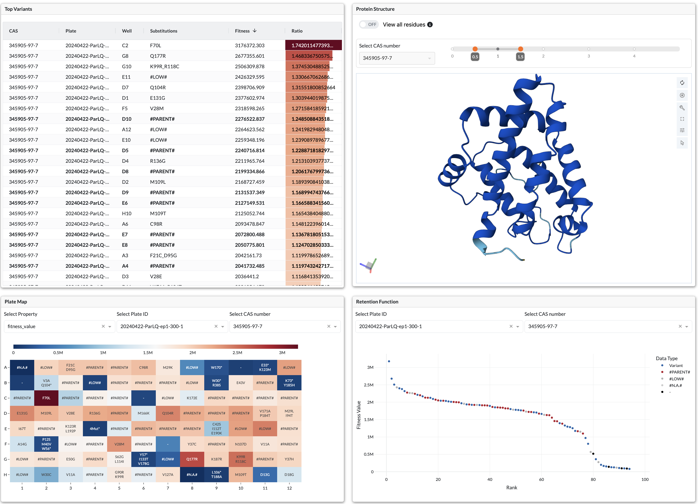
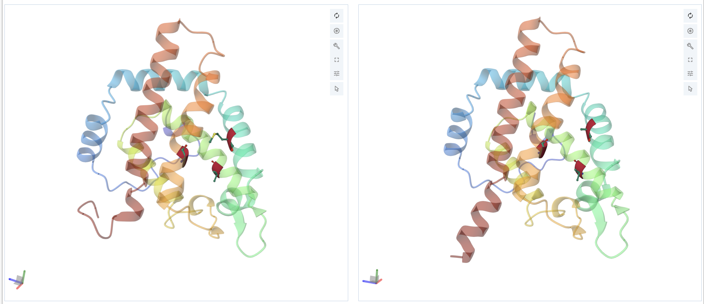

# SSEC-JHU LevSeq-Dash

<!------>
<!--- --->

# About

Levseq dash is a user-friendly web application that provides a rich and interactive visualization dashboard to a comprehensive sequence-function database tailored to directed evolution experiments designed for individual labs at this phase.
The app allows users to explore parent protein structures in 3D, view ligand docking interactions, and analyze 
variants to determine which mutations lead to enhanced activity. These features streamline the decision-making process, 
offering a significant improvement over traditional spreadsheet-based approaches.

See more about the experiment file structure here [TBD]

## Quick start Playground Mode [with Docker - recommended]:
  This mode is the **fastest way** to run the app. The repo already comes with a curated dataset.
  * Download & install Docker - see [Docker install docs](https://docs.docker.com/get-docker/).
  * Get the code: ``git clone https://github.com/ssec-jhu/levseq-dash.git``
  * cd into repo directory: ``cd levseq-dash``
  * Build  the docker image: ``docker build . -t levseq-dash-playground --no-cache``
  * Run the image: ``docker run -p 8060:8050 levseq-dash-playground``
  * App will be running at: ``http://0.0.0.0:8060``

## Quick start using your own dataset [with Docker]:
Use this mode if you want to provide a path to a folder located on your host machine.
Docker will require the path to mount. 
* [TBD]: describe file structure
* Build & Run the docker image: 
  * ``docker build . -t levseq-dash-with-my-data --no-cache``
  * ``docker run -p 8060:8050 -e DATA_PATH=/path/to/my/data -v /path/to/my/data:/path/to/my/data levseq-dash-with-my-data``
* App will be running at: ``http://0.0.0.0:8060``

## Building and Development [locally]

### with Tox
  * ``pip install tox`` if you don't have it already (this requires you have python installed on your machine already)
  * Make sure you are in the repo directory: ``cd levseq-dash``
  * Run: ``tox -e test exec -- python -m snaptron_query.app.main_dash_app``
  * Above line will install dependencies, run tests, and then run th app.
  * This will have Dash running locally on http://127.0.0.1:8050/
  * ``Ctrl+c`` to quit
  * 
### with Conda:

For additional cmds see the [Conda cheat-sheet](https://docs.conda.io/projects/conda/en/4.6.0/_downloads/52a95608c49671267e40c689e0bc00ca/conda-cheatsheet.pdf).

 * Download and install either [miniconda](https://docs.conda.io/en/latest/miniconda.html#installing) or [anaconda](https://docs.anaconda.com/free/anaconda/install/index.html).
 * Create new environment (env) and install ``conda create -n <environment_name>``
 * Activate/switch to new env ``conda activate <environment_name>``
 * Make sure you are in the repo directory: ``cd levseq-dash``
 * Install all required dependencies:  ``pip install -r requirements/all.txt``
 * Run ``python3 -m levseq_dash.app.main_app.py``
 * App will be running at: ``http://127.0.0.1:8050/``
 * Deactivate conda when done: ``conda deactivate``

## Testing with tox
Typically, the CI tests run in github actions will use tox to run below. No need to manually run these.

* ``cd levseq-dash``
* Run tox ``tox``. This will run all of linting, security, test, docs and package building within tox virtual environments.
* To run an individual step, use ``tox -e {step}`` for example:
  * ``tox -e test``
  * ``tox -e format``
  * ``tox -e py311``

