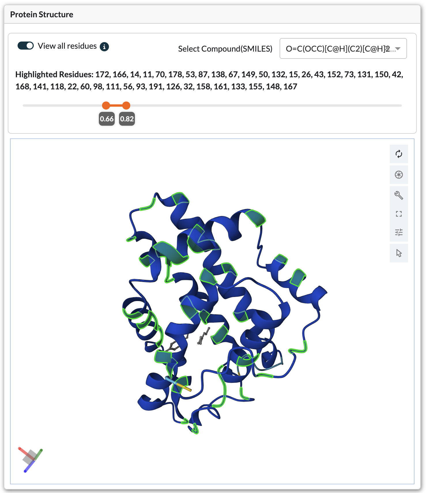
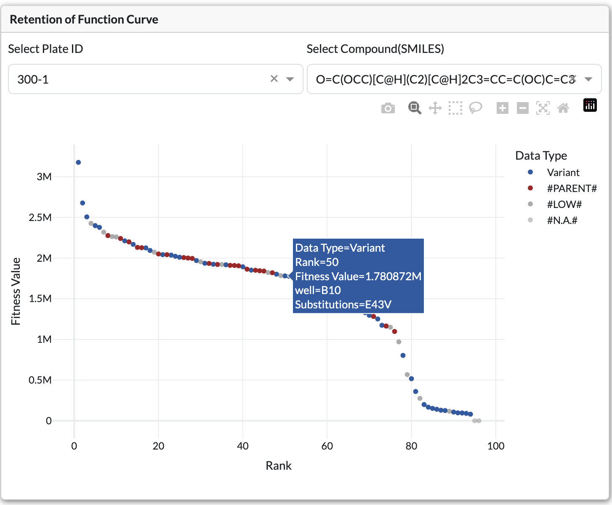
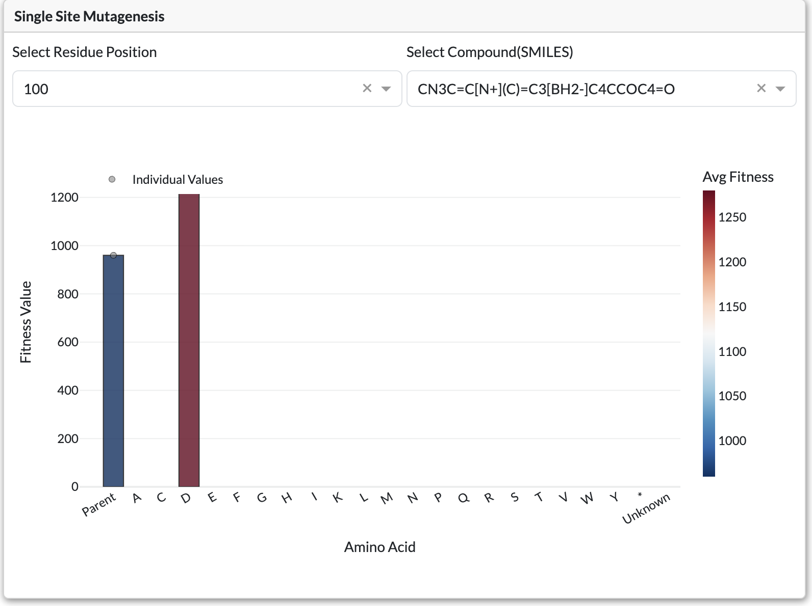

Usage Guide
===========

This guide covers how to install, configure, and use LevSeq-Dash for visualizing and analyzing directed evolution experiments.

.. contents:: Table of Contents
   :local:
   :depth: 2

Installation
------------

Prerequisites
~~~~~~~~~~~~~

- Python 3.9 or higher
- Docker (optional, for containerized deployment)
- Git

Quick Start with Docker
~~~~~~~~~~~~~~~~~~~~~~~

The fastest way to get started is using Docker:

.. code-block:: bash

    # Clone the repository
    git clone https://github.com/ssec-jhu/levseq-dash.git
    cd levseq-dash

    # Build the Docker image
    docker build . -t levseq-dash:latest --no-cache

    # Run in Public Playground mode
    docker run -p 8050:8050 levseq-dash:latest

The application will be available at http://0.0.0.0:8050

Local Installation
~~~~~~~~~~~~~~~~~~

For development or local use without Docker:

.. code-block:: bash

    # Clone the repository
    git clone https://github.com/ssec-jhu/levseq-dash.git
    cd levseq-dash

    # Install dependencies
    pip install -r requirements/requirements.txt

    # Run the application
    python -m levseq_dash.app.main_app

Configuration
-------------

Deployment Modes
~~~~~~~~~~~~~~~~

LevSeq-Dash supports two deployment modes:

**Public Playground Mode**

This mode is the **fastest way** to run the app and is ideal for demos, testing, and exploration 
of the curated sample dataset publicly available online at https://enzengdb.org/

- Read-only mode with example data
- No data modification allowed
- Perfect for exploring features and testing
- Uses pre-loaded sample experiments

**Local Instance Mode**

Use this mode for setting up an instance in your lab with persistent, user-controlled data storage.

- Full read/write access for lab use
- Upload and manage your own experiments
- Delete experiments as needed
- Customize data storage location
- Set unique experiment ID prefixes for your lab

Local Instance Setup
~~~~~~~~~~~~~~~~~~~~~

**Step 1: Configure config.yaml**

Open ``levseq_dash/app/config/config.yaml`` and configure it for local instance mode.

💡 **Hint**: You can copy/paste the configuration below and modify the values:

.. code-block:: yaml

    # Set deployment mode to local-instance
    deployment-mode: "local-instance"

    disk:
      # Enable data modification to allow adding/deleting data
      enable-data-modification: true
      
      # Set a unique 5-letter prefix for your lab or project 
      # OR set using environment variable
      five-letter-id-prefix: "MYLAB"
      
      # Example: absolute path of data on your desktop
      local-data-path: "/Users/<username>/Desktop/MyLabData"

**Step 2: Configure five-letter-id-prefix**

- This should be a unique identifier for your lab or project (e.g., "MYLAB", "JONES")
- It **must be exactly 5 letters long** and can only contain alphabetic characters (A-Z, a-z)
- This will be prefixed to all your experiment IDs (e.g., "MYLAB-EXP001")
- Helps distinguish experiments from different labs/projects

**Step 3: Configure local-data-path**

- This is where your experiment data will be stored on your local machine
- Use an **absolute path** (e.g., ``/Users/username/Desktop/MyLabData``)
- Make sure the directory exists and that you have write permissions to it
- All uploaded experiments will be stored here

**Using Docker with Environment Variables**

You can override config.yaml settings at runtime using environment variables to set up multiple instances:

- ``FIVE_LETTER_ID_PREFIX``: Configure the 5-letter prefix
- ``DATA_PATH``: Configure the local data path

**Docker Run Example**:

.. code-block:: bash

    # Run in local instance mode using settings in config.yaml
    docker run -p 8050:8050 levseq-dash:local

    # OR run with environment variables to override config.yaml settings 
    docker run -p 8050:8050 \
        -v /your/host/data/path:/data \
        -e DATA_PATH=/data \
        -e FIVE_LETTER_ID_PREFIX=MYLAB \
        levseq-dash:local

**Parameters Explained**:

- ``-v /your/host/data/path:/data``: Mounts a directory from your host machine to the ``/data`` directory inside the container
- ``-e DATA_PATH=/data``: Tells the application to use the ``/data`` directory for storage
- ``-e FIVE_LETTER_ID_PREFIX=MYLAB``: Sets your unique 5-letter lab/project identifier

Logging and Debugging
~~~~~~~~~~~~~~~~~~~~~~

Enable detailed logging for development and debugging:

.. code-block:: yaml

    # Logging and profiling settings for development and debugging
    logging:
      # Enable profiling for sequence alignment performance testing
      # Logs timing information for alignment operations (default: false)
      sequence-alignment-profiling: true
      
      # Enable detailed logging for data manager operations
      # Logs data loading, experiment management operations (default: false)
      data-manager: true
      
      # Enable logging for pairwise aligner detailed operations
      # Logs alignment algorithm details and performance (default: false)
      pairwise-aligner: true

**Logging Parameters**:

- ``sequence-alignment-profiling``: Enables timing logs for sequence alignment operations, useful for performance optimization
- ``data-manager``: Enables detailed logging of data loading, experiment metadata operations, and file I/O
- ``pairwise-aligner``: Enables verbose logging of the BioPython pairwise alignment algorithm details

.. note::
   These logging settings are primarily for development and debugging. Set all to ``false`` in production deployments to reduce log verbosity.

Uploading Experiments
---------------------

1. Navigate to the **Upload** page
2. Prepare your data:
   
   - **CSV file**: Experiment data with required columns (see below)
   - **CIF file**: Protein structure file in cif file (PDB format is not yet supported)

3. Fill in the metadata form:
   
   - Lab Experiment ID
   - Parent Sequence
   - Experiment Description
   - Date of the experiment
   - Valid SMILES strings used in the experiment as substrate and product

4. Click **Upload** to validate and store the experiment

5. On success, you will see a confirmation message and can navigate to the experiment page. 

If there are errors, they will be displayed for correction.

Required CSV Columns
~~~~~~~~~~~~~~~~~~~~

Your CSV file must include these columns:

- ``smiles_string``: Chemical structure in SMILES format
- ``fitness_value``: Activity/fitness measurement
- ``well``: Well position (e.g., "A01", "B12") - must be in standard 96-well plate format (A1-H12)
- ``plate``: Plate identifier (e.g., "1", "2", "Plate1")
- ``amino_acid_substitutions``: Amino acid mutations (e.g., "A123G", "M45K")
  
  - Must include at least one row with ``#PARENT#`` as the value to represent the parent sequence
  
- ``alignment_count``: Number of sequence alignments
- ``alignment_probability``: Probability score for the alignment

.. note::
   All SMILES strings must be valid chemical structures. Invalid SMILES will cause upload to fail with an error message indicating which row contains the invalid SMILES.

Exploring The Database
----------------------

.. figure:: _static/images/explore.png
   :alt: Explore page showing all experiments in an interactive table
   :height: 300px
   :align: center
   
   Explore page with experiment table, filters, and batch operation buttons

**Features**:

- View table of all uploaded experiments with metadata
- Interactive controls for filtering, sorting, and searching
- Select experiments to perform batch operations
- Export data in multiple formats

**Table Interactions**:

*Selection*:
    - **Single Selection**: Click any row to select it
    - **Multi-Selection**: Hold Ctrl (Cmd on Mac) and click multiple rows

*Filtering and Sorting*:
    - **Column Filters**: Click the filter icon in column headers to access filters
    - **Text Search**: Type in filter boxes to search within specific columns
    - **Sorting**: Click column headers to toggle ascending/descending sort
    - **Filter Persistence**: Filters are automatically saved in browser session storage

*Data Export*:
    - **Export Filtered Data**: Download a CSV file containing only the currently filtered rows
    - **Export Selected**: Download multiple experiments as a ZIP file (see Actions below)

**Available Actions** (Buttons activate based on row selection):

- **Go To Experiment**: Navigate to detailed experiment view
    
    - Requires: Exactly 1 row selected

- **Download Selected Experiments**: Export experiments as a ZIP archive
    
    - Requires: 1 or more rows selected

- **Delete**: Remove experiment from the system
    
    - Requires: Exactly 1 row selected
    - Only available in Local Instance mode
    - Note: Files are moved to a backup folder, not permanently deleted

Single Experiment Page
----------------------

After selecting an experiment from the Explore page, you can view detailed analysis and visualizations.

**Page Components**:

- **Protein Structure Viewer**: 3D visualization (if CIF file provided)
- **Experiment Metadata Panel**: Shows experiment details
- **Top Variants Table**: Interactive table of all variants
- **Heatmap**: Visualizes variant data across well plates
- Key components include:

- **Experiment Table**: Interactive table showing all experiments with filtering and sorting capabilities
- **Search and Filter**: Quick filtering by experiment name, barcode, or properties
- **Retention of Function Curve / Single Site Mutagenesis Plot**: Shows variant rankings by fitness
- **Reaction Visualization**: Displays substrate/product chemistry

Protein Structure Viewer (3D)
~~~~~~~~~~~~~~~~~~~~

    
    3D protein structure viewer with highlighted mutation positions

*Navigation Controls*:
- **Rotate**: Left-click and drag
- **Zoom**: Scroll wheel or pinch gesture
- **Pan**: Right-click and drag (or Ctrl + left-click)
- **Reset View**: Click the home icon in viewer controls

Residue Highlighting
~~~~~~~~~~~~~~~~~~~~

Residues can be highlighted in two ways:

1. *Table Selection**: Select a variant row to highlight its mutation positions
2. *View All Residues Mode*:
   
   - Enable the **"View All Residues"** toggle switch
   - Use the **Fitness Ratio Slider** to set threshold (e.g., 1.5-5.0)
   - Viewer highlights all residues appearing in variants above threshold
   - Filter by specific substrate/product using **SMILES dropdown**
   - Info text displays which residues are currently highlighted

Top Variants Table
~~~~~~~~~~~~~~~~~~~~

*Features*:

- Displays all variants from the experiment
- Rows are color-coded by fitness ratio
- Select rows to highlight mutations in the 3D protein viewer
- Filter by fitness ratio range using slider controls

*Selection*:

- **Single Selection**: Click any row to select it
- **Multi-Selection**: Hold Ctrl (Cmd on Mac) and click multiple rows

*Filtering and Sorting*:

- **Column Filters**: Click the filter icon in column headers
- **Text Search**: Type in filter boxes to search within specific columns
- **Sorting**: Click column headers to toggle ascending/descending sort

Heatmap Visualization
~~~~~~~~~~~~~~~~~~~~~

.. figure:: _static/images/heatmap.png
    :alt: Heatmap visualization of variant fitness across well plates
    :height: 400px
    :align: center
    
    Interactive heatmap showing fitness values color-coded by well position

Visualizes variant data across well plates with color-coded values.

**Controls**:

- **Plate Dropdown**: Select which plate to view
- **SMILES Dropdown**: Choose substrate/product combination
- **Property Dropdown**: Select visualization property:
  
  - **Fitness**: Shows fitness values
  - **Mean/Median/Std Dev**: Statistical summaries across plates

**Interactions**:

- Click individual wells to see detailed variant information
- Hover over wells for quick data preview

Retention of Function Curve
~~~~~~~~~~~~~~~~~~~~~~~~~~~~

    
    Bar chart displaying ranked variants by fitness value

Shows all variants ranked by fitness value. Bars are color-coded by fitness ratio relative to parent.

**Controls**:

- **Plate Dropdown**: Filter by specific plate
- **SMILES Dropdown**: Filter by substrate/product

**Chart Elements**:

- **X-axis**: Variant identifier or mutation
- **Y-axis**: Fitness value
- **Hover**: Displays detailed variant information

Single-Site Mutagenesis (SSM) Plot
~~~~~~~~~~~~~~~~~~~~~~~~~~~~~~~~~~~

    Single-Site Mutagenesis plot displaying fitness values for all amino acid substitutions at a position

Appears for Site Specific experiments instead of retention of function curve. Shows fitness for each amino acid substitution at a selected position.

**Controls**:

- **Residue Position Dropdown**: Select which position to analyze
- **SMILES Dropdown**: Filter by substrate/product

**Chart Elements**:

- **Bars**: Fitness value for each amino acid substitution
- **Dotted Line**: Parent sequence fitness (reference)
- **Hover**: Shows amino acid and fitness details

Related Variants Tabs
~~~~~~~~~~~~~~~~~~~~~

Find experiments with similar sequences that have variants at specific positions.

.. figure:: _static/images/related_variants.png
    :alt: Related Variants tab showing similar experiments with variants at lookup positions
    :height: 400px
    :align: center

    Related Variants tab displaying similar experiments with variants at lookup positions.

**Setup**

1. Query sequence is auto-filled with current experiment's parent sequence
2. Set **Alignment Threshold** (default 0.8): Minimum sequence similarity (0-1 scale, where 1.0 = 100% match)
3. Enter **Lookup Residues**: Comma-separated positions to check (e.g., "100,150,200")
4. Click **Run** to search

**Understanding Results and Comparison View**

- Table shows experiments with similar parent sequences and with variants at lookup positions
- Select a row to compare protein structures side-by-side
- Reaction images shows substrate/product for comparison
- Left protein structure panel shows current experiment structure with highlighted positions
- Right protein structure panel shows selected match structure with highlighted positions

**Color Coding**:

- *Red**: Gain-of-function variants
- *Blue**: Loss-of-function variants
- *Purple**: Positions that both showed GoF and LoF variants

Sequence Alignment
------------------

The Sequence Alignment feature allows you to search across all experiments in the database to find those with similar parent sequences to your query. This is particularly useful for:

- Identifying related enzyme variants across different experiments
- Finding experiments that may have explored similar sequence space
- Comparing gain-of-function and loss-of-function mutations across related proteins
- Discovering which residue positions are critical for function across protein families

Overview
~~~~~~~~

The alignment tool uses BLASTP-style pairwise sequence alignment to compare your query sequence against all parent sequences in the database. When matches are found, the system analyzes the variants in those experiments to identify positions that consistently show gain-of-function (GoF) or loss-of-function (LoF) mutations.

Running an Alignment Search
~~~~~~~~~~~~~~~~~~~~~~~~~~~~

**Step 1: Navigate and Enter Query**

1. Navigate to **Matching Sequences** page from the sidebar
2. Enter your query protein sequence in the text area:
   
   - Must be a valid amino acid sequence (single-letter codes)
   - Remove any non-sequence letters (e.g., whitespace, numbers, >, <)

**Step 2: Configure Search Parameters**

- **Alignment Threshold** (0-1 scale): 
  
  - Sets the minimum sequence identity for matches to be returned, where 1.0 = 100% match
  - Default: 0.8 is recommended as a starting point
  - Lower values (0.6-0.7) will find more distantly related sequences
  - Higher values (0.9-1.0) will only find very similar sequences
  - Example: 0.8 means at least 80% of aligned positions must be identical

- **Top N GoF/LoF Positions**:
  
  - Specifies how many gain-of-function and loss-of-function positions to identify
  - Default: Top 2 for each category
  - These positions are ranked by the magnitude of fitness change across variants
  - Helps focus on the most impactful mutations

**Step 3: Execute Search**

Click **Run Alignment** to start the search. The system will:

1. Align your query against all database parent sequences
2. Filter results by the alignment threshold
3. Analyze variants at each position in matching experiments
4. Identify and rank positions showing gain or loss of function

Understanding the Results
~~~~~~~~~~~~~~~~~~~~~~~~~~

**Matched Sequences Table**

This table displays all experiments with parent sequences that meet your alignment threshold:

*Key Columns*:

- **Experiment ID**: Click to navigate to the full experiment page
- **Alignment Score**: Raw alignment score from the pairwise alignment algorithm
- **Percent Identity**: Percentage of aligned positions that are identical matches
- **Substitutions**: Amino acid differences between query and target sequence
- **Gap Count**: Number of insertions/deletions in the alignment
- **Parent Sequence Length**: Length of the matched parent sequence

*Interpreting Results*:

- Higher percent identity indicates more similar sequences
- Review substitutions to understand key differences between sequences
- Experiments with similar percent identity but different substitutions may have explored different regions of sequence space

**Gain-of-Function (GoF) and Loss-of-Function (LoF) Mutations Table**

This table aggregates mutation data across all matched experiments to identify critical residue positions:

*Understanding GoF Mutations* (marked in red):

- Positions where mutations consistently lead to **increased** fitness values
- Fitness ratio > 1.0 relative to parent sequence
- These positions may represent opportunities for enhancing enzyme activity
- Higher fitness values indicate stronger gain-of-function effects

*Understanding LoF Mutations* (marked in blue):

- Positions where mutations consistently lead to **decreased** fitness values
- Fitness ratio < 1.0 relative to parent sequence
- These positions may be critical for maintaining protein structure or catalytic function
- Lower fitness values indicate stronger loss-of-function effects

*Table Columns*:

- **Position**: Residue position number in the aligned sequence
- **Mutation Type**: GoF (gain), LoF (loss), or Both (positions showing mixed effects)
- **Average Fitness Ratio**: Mean fitness across all variants at this position
- **Count**: Number of different amino acid substitutions observed at this position
- **SMILES**: Substrate/product combinations where effects were observed
- **Top Variants**: Specific mutations with highest/lowest fitness

*Export Options*:

- Click **Export** to download the table as CSV for further analysis
- Use in downstream analysis, publication figures, or experimental design

Protein Structure Visualization
~~~~~~~~~~~~~~~~~~~~~~~~~~~~~~~~

When you select a row from the Matched Sequences table, the 3D protein structure viewer displays the matched experiment's structure with color-coded mutation positions:

.. figure:: _static/images/alignment.png
    :alt: Sequence alignment view showing matched experiments with color-coded GoF and LoF positions
    :height: 500px
    :align: center
    
    Protein structure viewer displaying gain-of-function (red), loss-of-function (blue), and mixed (purple) mutation positions

**Color Coding Scheme**:

- **Red residues**: Positions where gain-of-function mutations were observed
- **Blue residues**: Positions where loss-of-function mutations were observed
- **Purple residues**: Positions showing both GoF and LoF mutations

**Viewer Interactions**:

- Rotate, zoom, and pan to examine positions in 3D structural context
- Identify whether GoF/LoF positions cluster together (potential active site)
- Check if critical positions are on protein surface or buried in core
- Look for spatial relationships between different mutation types

Tips for Effective Alignment Searches
~~~~~~~~~~~~~~~~~~~~~~~~~~~~~~~~~~~~~~

**Choosing Alignment Threshold**:

- Start with 0.8 if you're unsure
- Use 0.9-1.0 for finding very closely related variants (same protein family)
- Use 0.6-0.8 for finding more distant homologs or related enzyme classes
- Lower thresholds will increase search time but may reveal interesting distant relationships

**Performance Considerations**:

- Searches typically complete in seconds to minutes depending on database size
- Very long query sequences (>1000 AA) may take longer
- Large numbers of matches (>100) may take time to analyze variants